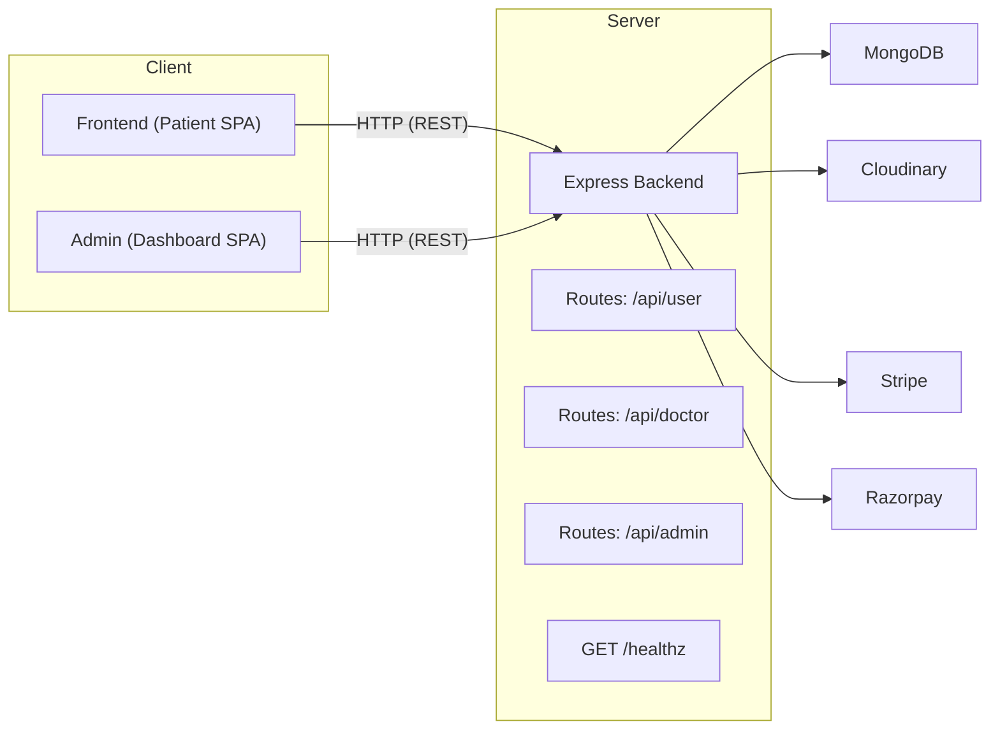

# Prescripto Full-Stack Doctor Appointment App — Production Documentation

## Introduction

### Overview
Prescripto is a full-stack MERN (MongoDB, Express.js, React, Node.js) application that enables patients to book appointments with doctors, manage profiles, and make payments. It supports three roles—Patient, Doctor, and Admin—with distinct SPA frontends for Patient and Admin and a unified Express backend. Payments are integrated via Stripe and Razorpay, user images are stored on Cloudinary, and data is persisted in MongoDB.

### Scope
This document provides a production-oriented overview of the architecture, services, environment configuration, authentication and authorization flows, feature set, API and routing details (including /healthz), third-party integrations, and setup/run instructions for all containers (backend, frontend, admin). It reflects the current codebase and configuration.

## Architecture

### System Components
- Backend (Express/Node) — REST API, authentication, payments, image uploads, health check.
- Frontend (React/Vite) — Patient-facing SPA for browsing doctors, booking and paying for appointments, and managing profile/appointments.
- Admin (React/Vite) — Admin dashboard SPA for doctor management, appointment oversight, and analytics.
- MongoDB — Primary data store (Users, Doctors, Appointments).
- Cloudinary — Image storage for user/doctor images.
- Stripe & Razorpay — Payment gateways for online payments.

### High-Level Diagram


### Backend Structure
- Entry: backend/server.js
  - Express app with JSON and CORS middleware.
  - Health endpoint: GET /healthz (reports service and DB status; returns 200 when DB connected, else 503).
  - API routers mounted at:
    - /api/user (backend/routes/userRoute.js)
    - /api/admin (backend/routes/adminRoute.js)
    - /api/doctor (backend/routes/doctorRoute.js)
  - Integrations initialized at startup:
    - MongoDB connection with retry (backend/config/mongodb.js)
    - Cloudinary configuration (backend/config/cloudinary.js)
- Controllers:
  - backend/controllers/userController.js
  - backend/controllers/doctorController.js
  - backend/controllers/adminController.js
- Models (Mongoose):
  - backend/models/userModel.js
  - backend/models/doctorModel.js
  - backend/models/appointmentModel.js
- Middleware:
  - backend/middleware/authUser.js (JWT auth)
  - backend/middleware/authDoctor.js (JWT auth)
  - backend/middleware/authAdmin.js (JWT and ADMIN_EMAIL/PASSWORD check)
  - backend/middleware/multer.js (file uploads)

### Frontend Structure (Patient SPA)
- Entry: frontend/src/main.jsx; App: frontend/src/App.jsx
- Context: frontend/src/context/AppContext.jsx
  - Reads API base URL via import.meta.env.VITE_BACKEND_URL.
  - Maintains token (JWT), user profile data, and doctors listing.
- Pages: Home, Doctors, Appointment, MyProfile, MyAppointments, Login, Verify, etc.
- Uses axios for API calls and react-toastify for notifications.

### Admin Structure (Dashboard SPA)
- Entry: admin/src/main.jsx; App: admin/src/App.jsx
- Context:
  - admin/src/context/AppContext.jsx (currency and backend URL)
  - admin/src/context/AdminContext.jsx (admin APIs and dashboard state)
  - admin/src/context/DoctorContext.jsx (doctor panel interactions when used within admin scope)
- Pages: Dashboard, Doctors List, Add Doctor, All Appointments, Login.
- Uses axios and react-toastify.

## Authentication and Authorization

### Tokens and Roles
- JWT tokens are issued by the backend using JWT_SECRET:
  - User Token: returned on successful patient login/registration.
  - Doctor Token: returned on doctor login.
  - Admin Token: returned on admin login if ADMIN_EMAIL and ADMIN_PASSWORD match environment values.

### Headers
- User-protected routes expect header: token: <JWT>
- Doctor-protected routes expect header: dToken: <JWT>
- Admin-protected routes expect header: aToken: <JWT>

Middleware validates tokens and binds user/doctor/admin IDs or checks admin credentials.

### Flow Summary
- Patient:
  1) Register or Login to receive token.
  2) Use token to access profile, book appointments, manage appointments, and initiate payments.
- Doctor:
  1) Login to receive token.
  2) Access dashboards, view and manage own appointments, update profile and availability.
- Admin:
  1) Login with configured credentials to receive token.
  2) Manage doctors and global appointments, view analytics dashboard.

## Major Features

### Patient-Facing
- Browse doctors (/api/doctor/list).
- Book appointment with selected doctor and slot.
- Pay via Stripe Checkout session or Razorpay order.
- View and cancel appointments.
- Manage user profile and upload profile image to Cloudinary.

### Doctor Panel
- View appointments assigned to doctor.
- Cancel or mark appointments as completed.
- Update profile (fees, address, availability).
- Dashboard analytics (earnings, number of appointments, patient count, latest appointments).

### Admin Dashboard
- Login and access protected routes.
- Add doctors (with image upload via Cloudinary).
- List all doctors; toggle availability.
- View and cancel any appointment.
- Dashboard analytics (doctors, appointments, patients, latest bookings).

## API and Routing

### Health and Root
- GET /healthz
  - 200 if db: "connected", else 503.
  - Body: { "service":"ok", "db":"connected|connecting|disconnected|error", "time":"ISO" }
- GET /
  - Returns "API Working" for basic sanity check.

### User Routes (/api/user)
- POST /register — registerUser
- POST /login — loginUser
- GET /get-profile — getProfile (authUser)
- POST /update-profile — updateProfile (authUser + multer.single('image'))
- POST /book-appointment — bookAppointment (authUser)
- GET /appointments — listAppointment (authUser)
- POST /cancel-appointment — cancelAppointment (authUser)
- POST /payment-razorpay — paymentRazorpay (authUser)
- POST /verifyRazorpay — verifyRazorpay (authUser)
- POST /payment-stripe — paymentStripe (authUser)
- POST /verifyStripe — verifyStripe (authUser)

### Doctor Routes (/api/doctor)
- POST /login — loginDoctor
- GET /appointments — appointmentsDoctor (authDoctor)
- POST /cancel-appointment — appointmentCancel (authDoctor)
- POST /complete-appointment — appointmentComplete (authDoctor)
- GET /dashboard — doctorDashboard (authDoctor)
- GET /profile — doctorProfile (authDoctor)
- POST /update-profile — updateDoctorProfile (authDoctor)
- GET /list — doctorList (public, used by Frontend doctor search/list)

### Admin Routes (/api/admin)
- POST /login — loginAdmin
- POST /add-doctor — addDoctor (authAdmin + multer.single('image'))
- GET /appointments — appointmentsAdmin (authAdmin)
- POST /cancel-appointment — appointmentCancel (authAdmin)
- GET /all-doctors — allDoctors (authAdmin)
- POST /change-availability — changeAvailablity (authAdmin)
- GET /dashboard — adminDashboard (authAdmin)

## Third-Party Integrations

### MongoDB (Mongoose)
- Connection logic with retry and status tracking in backend/config/mongodb.js.
- Uses MONGODB_URI and DB_NAME (default prescripto).

### Cloudinary
- Configured in backend/config/cloudinary.js.
- Safe no-op if CLOUDINARY_* variables are not set.
- Used for user and doctor image uploads.

Required variables:
- CLOUDINARY_NAME
- CLOUDINARY_API_KEY
- CLOUDINARY_API_SECRET

Note: Code currently expects CLOUDINARY_SECRET_KEY; ensure consistency with CLOUDINARY_API_SECRET in env. Use matching names in deployment.

### Stripe
- Stripe initialized with STRIPE_SECRET_KEY in userController; payments disabled if missing.
- Creates Checkout Sessions with success/cancel URLs based on Origin header.
- Requires CURRENCY environment variable (e.g., INR, USD).

Backend variables:
- STRIPE_SECRET_KEY (secret)
- CURRENCY (public info but set server-side)

Frontend/Admin variables (public):
- VITE_STRIPE_API_KEY if client-side Stripe libraries are used to display branding or initialize UI (if applicable). Current code flows use backend-created Checkout sessions.

### Razorpay
- Orders are created and verified via Razorpay SDK in userController.
- Backend variables:
  - RAZORPAY_KEY_ID
  - RAZORPAY_KEY_SECRET
  - CURRENCY

Frontend/Admin variables (public):
- VITE_RAZORPAY_API_KEY used by clients to load Razorpay widget if needed.

## Environment Variables

This project uses Vite for frontend/admin, which exposes only variables prefixed with VITE_. Do not expose server secrets via client variables.

### Backend (Express)
Required/used:
- PORT (default 3001)
- CORS_ORIGIN — comma-separated origins (e.g., http://localhost:5173,http://localhost:5174)
- MONGODB_URI — connection string (secret)
- DB_NAME — default prescripto
- JWT_SECRET — JWT signing secret (secret)
- CLOUDINARY_NAME (secret)
- CLOUDINARY_API_KEY (secret)
- CLOUDINARY_API_SECRET (secret) — ensure consistent key name with code
- CURRENCY — e.g., INR
- STRIPE_SECRET_KEY (secret)
- RAZORPAY_KEY_ID (secret)
- RAZORPAY_KEY_SECRET (secret)
- ADMIN_EMAIL (secret)
- ADMIN_PASSWORD (secret)

Secrets should only be present on the backend container.

### Frontend (Patient SPA)
Public (Vite-exposed):
- VITE_BACKEND_URL — base URL to backend API (e.g., http://localhost:3001)
- Optional (if used in client-side payment libs):
  - VITE_STRIPE_API_KEY — publishable key
  - VITE_RAZORPAY_API_KEY — public key
- VITE_CURRENCY (optional, used in admin AppContext)

Never expose:
- Mongo URI, JWT secrets, Stripe/Razorpay secrets.

### Admin (Dashboard SPA)
Public (Vite-exposed):
- VITE_BACKEND_URL — base URL to backend API (e.g., http://localhost:3001)
- VITE_CURRENCY (optional)
- Optional:
  - VITE_STRIPE_API_KEY — publishable key
  - VITE_RAZORPAY_API_KEY — public key

## Setup and Run Instructions

### Prerequisites
- Node.js (LTS)
- Access to MongoDB (URI or local instance)
- Accounts/keys for Cloudinary, Stripe, and Razorpay if enabling those features

### Backend
1) Install dependencies:
- cd backend
- npm install

2) Configure environment (example .env):
```
PORT=3001
CORS_ORIGIN=http://localhost:5173,http://localhost:5174

MONGODB_URI=mongodb+srv://<user>:<pass>@<cluster>/<db>?retryWrites=true&w=majority
DB_NAME=prescripto

JWT_SECRET=replace_with_strong_secret

# Cloudinary
CLOUDINARY_NAME=your_cloud_name
CLOUDINARY_API_KEY=your_cloudinary_api_key
CLOUDINARY_API_SECRET=your_cloudinary_api_secret

# Payments
CURRENCY=INR
STRIPE_SECRET_KEY=sk_test_xxx
RAZORPAY_KEY_ID=rzp_test_xxx
RAZORPAY_KEY_SECRET=your_razorpay_secret

# Admin bootstrap
ADMIN_EMAIL=admin@example.com
ADMIN_PASSWORD=change_me
```

3) Run:
- Development: npm run dev
- Production: npm start
- Health check: GET http://localhost:3001/healthz

### Frontend (Patient SPA)
1) Install dependencies:
- cd frontend
- npm install

2) Configure environment (example .env):
```
VITE_BACKEND_URL=http://localhost:3001
VITE_STRIPE_API_KEY=pk_test_xxx
VITE_RAZORPAY_API_KEY=rzp_test_xxx_public
```

3) Run:
- npm run dev
- Open http://localhost:5173

### Admin (Dashboard SPA)
1) Install dependencies:
- cd admin
- npm install

2) Configure environment (example .env):
```
VITE_BACKEND_URL=http://localhost:3001
VITE_CURRENCY=INR
VITE_STRIPE_API_KEY=pk_test_xxx
VITE_RAZORPAY_API_KEY=rzp_test_xxx_public
```

3) Run:
- npm run dev
- Open http://localhost:5174

## Production Considerations

### CORS
Configure CORS_ORIGIN in backend to the exact origins that will serve the SPAs. Credentials are enabled.

### Health Checks and Readiness
Use GET /healthz to monitor service status. It returns HTTP 200 only when MongoDB is connected.

### Errors and Logging
- Backend logs startup configuration hints (presence of key envs).
- Stripe initialization logs explicit warnings if not configured.

### Security
- Keep all secrets only on the backend.
- Do not leak JWT_SECRET or database credentials to frontend/admin.
- Use HTTPS in production for all SPAs and backend API.

## Data Models (Summary)

While full schema definitions are in backend/models:
- User: name, email, password (hashed), image, phone, address (object), gender, dob, etc.
- Doctor: name, email, password (hashed), speciality, degree, experience, about, fees, address, availability, slots_booked (per date/time).
- Appointment: userId, docId, userData, docData, amount, slotDate, slotTime, payment (bool), cancelled (bool), isCompleted (bool), date.

## Build and Deployment Notes

- Backend binds to 0.0.0.0 and default port 3001, configurable via PORT.
- Frontend Vite dev server defaults to 5173; Admin defaults to 5174.
- For containerized environments, map Vite environment variables to VITE_* and server-only env vars to backend service. Refer to manifest.yaml for example mappings, including /healthz routing.

## Appendix: Route Summary

- Public:
  - GET / — "API Working"
  - GET /healthz — health check
  - GET /api/doctor/list — doctor list for clients
- Authenticated:
  - User: profile, booking, appointments, cancellations, payment endpoints
  - Doctor: appointments, cancel/complete, profile, dashboard
  - Admin: doctors, add-doctor, change-availability, appointments, dashboard

## References

- Key Source Files Consulted:
  - backend/server.js
  - backend/config/mongodb.js
  - backend/config/cloudinary.js
  - backend/routes/userRoute.js
  - backend/routes/doctorRoute.js
  - backend/routes/adminRoute.js
  - backend/controllers/userController.js
  - backend/controllers/doctorController.js
  - backend/controllers/adminController.js
  - frontend/src/context/AppContext.jsx
  - admin/src/context/AppContext.jsx
  - admin/src/context/AdminContext.jsx
  - admin/src/context/DoctorContext.jsx
  - manifest.yaml
